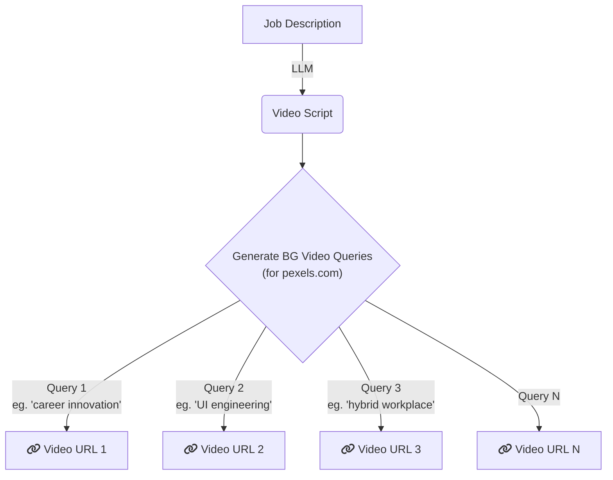

# Interview Screening Task 

## Background

Our tool automatically generates job ads, like [this one *(click here to view the job ad)*](https://drive.google.com/file/d/1mra8zrVSOoAEOp01m-cM8NZpWTEuhfr1/view?usp=sharing). We use the pexels.com API to source background videos for these ads.

> [!IMPORTANT]  
> We aim for the background videos to be as closely related as possible to the job description or job ad.

In order to generate the BG videeos, we take job description as an input and generate script content for the specific job ad video using LLMs. The script content is then again used to to generate keyword queries that are used to generate background videos from pexels.com API.

# Task

Your task is to write an algorithm that provides binary "yes" / "no" value corresponding to each video URL that is being provided by pexels.com.

The value must be "yes" if the video is related to job ad in some sense and it should be "no" otherwise. For example, query "enginnering manager" may result in [this video](https://videos.pexels.com/video-files/8488276/8488276-hd_1920_1080_30fps.mp4) which in context of *software engineering job ad* does **NOT** make any sense. In this case, you should output as "no".
