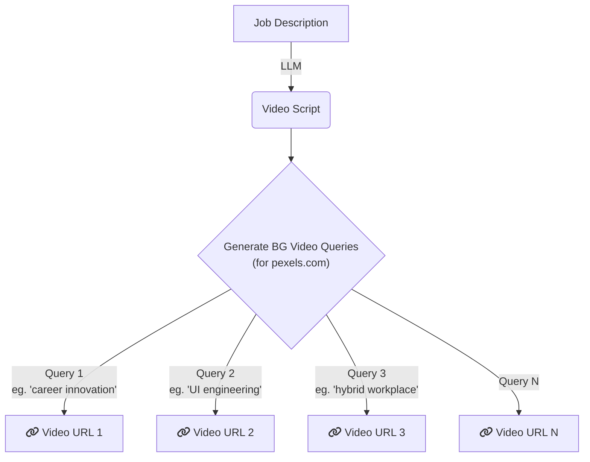

# Interview Screening Task 

## Background

Our tool automatically generates job ads, like [this one *(click here to view the job ad)*](https://drive.google.com/file/d/1mra8zrVSOoAEOp01m-cM8NZpWTEuhfr1/view?usp=sharing). We use the pexels.com API to source background videos for these ads.

> [!IMPORTANT]  
> We aim for the background videos to be as closely related as possible to the job description or job ad.

## Current Process

We take job description as an input and generate script content for the specific job ad video using LLMs. The script content is then again used to to generate keyword queries that are used to generate background videos from pexels.com API.

# Task

