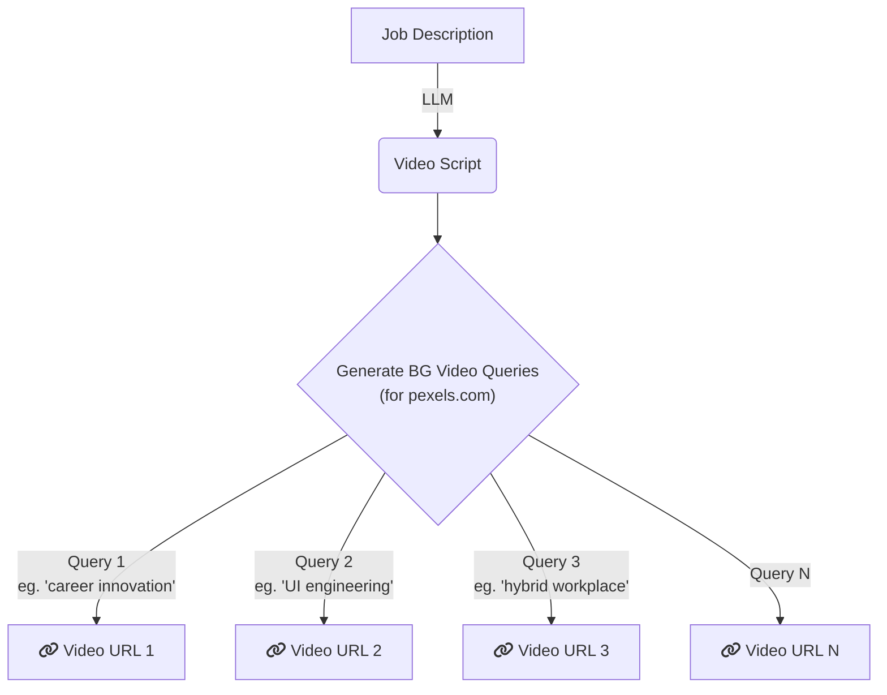

# Interview Screening Task 

## Background

Our tool automatically generates job ads, like [this one *(click here to view the job ad)*](https://drive.google.com/file/d/1mra8zrVSOoAEOp01m-cM8NZpWTEuhfr1/view?usp=sharing). We use the pexels.com API to source background videos for these ads.

> [!IMPORTANT]  
> We aim for the background videos to be as closely related as possible to the job description or job ad.

In order to generate the BG videos, we take job description as an input and generate script content for the specific job ad video using LLMs. The script content is then again used to to generate keyword queries that are used to generate background videos from pexels.com API. The videos are then *cropped and merged* to form the background video for that specific job ad.

# Dataset

You are given a [CSV file](./screening_task_data.csv) with following columns:

1. `job_link`: The job link for which we are generating the job ad video background
2. `pexels_query`: The query that was used to fetch backgoround video from pexels.com
3. `bg_video_url`: The response for `pexels_query` from pexels.com that will be used as background video.
4. `is_related`: Empty column that need to be filled by you.

Each row corresponds to a single video that was fetched from pexels.com.

# Task

Your task is to write an algorithm that provides binary "yes" / "no" value corresponding to each video URL that is being provided by pexels.com. This value must be filled in `is_related` column.

The value must be "yes" if the video is related to job ad in some sense and it should be "no" otherwise. For example, query "engineering manager" may result in [this video](https://videos.pexels.com/video-files/8488276/8488276-hd_1920_1080_30fps.mp4) which in context of *software engineering job ad* does **NOT** make any sense. In this case, you should output as "no".

# Scoring Criteria

You will be scored based on the following:

- Your ability to understand the problem, how you solved the problem or why couldn't you solve the problem. 
- Accuracy of your algorithm to flag irrelevant videos.
- Latency of your algorithm (lower the better).
- Research skills.

## Submission

Send your submission as a compressed ZIP file to rakesh@alphanome.ai and info@alphanome.ai (Please add both the emails).

The ZIP file must contain the following:
- Source code for the algorithm.
- CSV file with filled `is_relevant` column.
- Detailed instructions on how to run the algorithm.
- Any additional files that you want to add.

---

If you have any questions, write to rakesh@alphanome.ai and / or info@alphanome.ai

